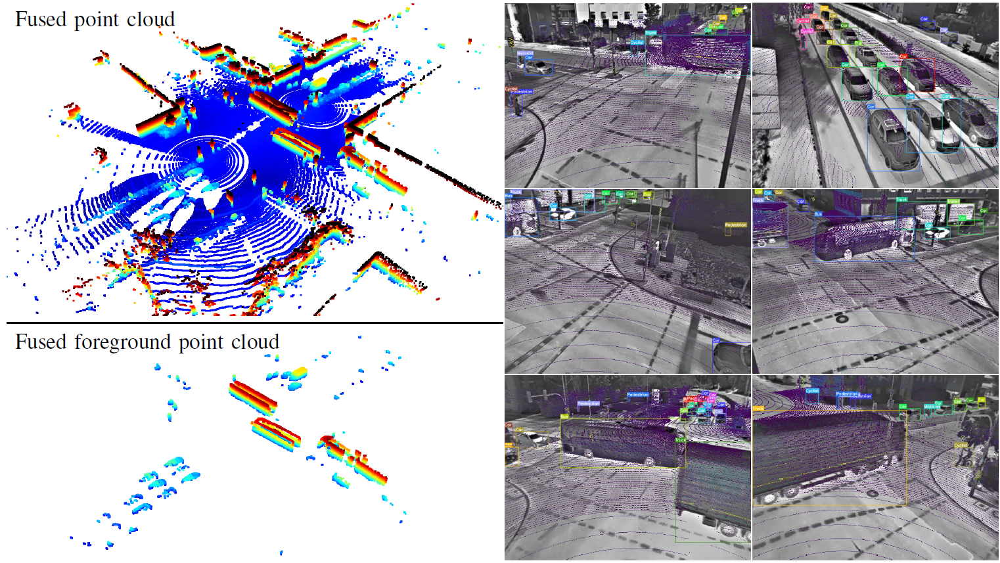
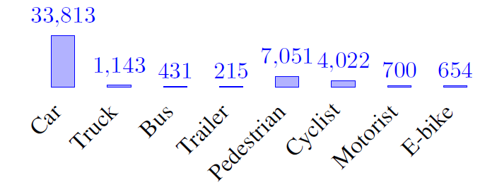

# Fusion-Object-Detector: Thermal-camera-and-LiDAR-in-Infrastructure-Dataset

Official page for the paper: **Open-Set Object Detection for the Identification and Localization of Dissimilar Novel Classes by means of Infrastructure Sensors**

## Dataset Download

The dataset can be downloaded from the following link: [Download the Dataset](https://faubox.rrze.uni-erlangen.de/getlink/fiYGhgiVRNcsD43Ki8jSko/main.zip)

## Dataset Overview

TLID dataset is captured using 16 thermal cameras and 8 LiDAR setups mounted at 3 different highly busy crossings of Ingolstadt city, namely Goethe straße, shiller straße and Friedrich-Ebert straße and at the CARISSMA outdoor test track. These sensors are part of the High-Definition Test track (HDT), a smart infrastructure built in Ingolstadt city for studying the interaction between traffic participants.

<div style="text-align: center;">
  
  <p>A snapshot of the TLID dataset is shown. On the left, the fused and foreground point cloud from 4 LiDAR sensors is shown. On the right, 6 annotated thermal camera images with projected space-time synchronized point cloud are shown. All are captured at the crossing between Goethe straße and Schiller straße in Ingolstadt city, Germany.</p>
</div>

The dataset includes 7070 images and 5028 point clouds in total. It consists of 48k 2D labels across 8 classes, and the class distribution is shown in following figure:

<div style="text-align: center;">
  
  <p>TLID dataset class distribution</p>
</div>

It is important to mention that out of the 7070 labelled images, 4662 of them have corresponding time-synchronized point clouds.

## Citation

If you use this dataset or find our research useful, please cite our papers in your work:

```
@inproceedings{sekaran2024fodtlid,
author = {Karthikeyan Chandra Sekaran, Lakshman Balasubramanian, Michael Botsch and Wolfgang Utschick},
title = {Open-Set Object Detection for the Identification and Localization of Dissimilar Novel Classes by means of Infrastructure Sensors},
booktitle = {2024 IEEE Intelligent Vehicles Symposium (IV)},
year = {2024},
address = {South Korea},
publisher = {IEEE}
}

@inproceedings{sekaran2023metric,
  title={Metric Learning Based Class Specific Experts for Open-Set Recognition of Traffic Participants in Urban Areas Using Infrastructure Sensors},
  author={Sekaran, Karthikeyan Chandra and Balasubramanian, Lakshman and Botsch, Michael and Utschick, Wolfgang},
  booktitle={2023 IEEE Intelligent Vehicles Symposium (IV)},
  pages={1--8},
  year={2023},
  organization={IEEE},
  doi={10.1109/IV55152.2023.10186527}
}
```

## Acknowledgement
This work is supported by Bundesministerium für Digitales und Verkehr, Germany under the funding code 45KI05D041.
